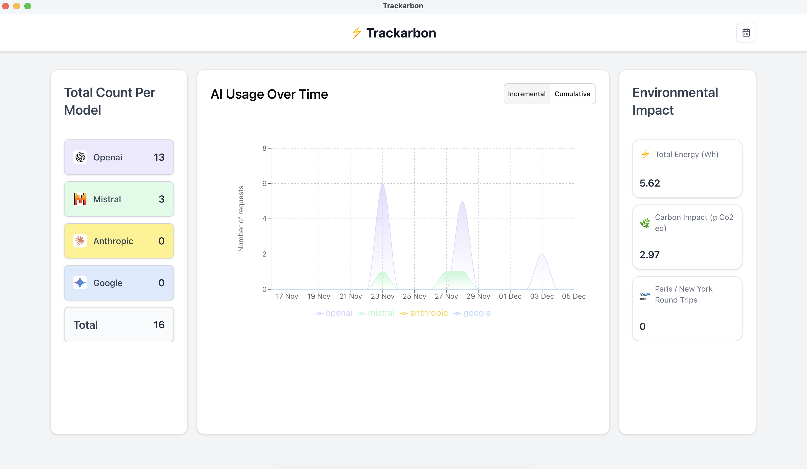

<div align="center">

# 🌱 Trackarbon Core

**Open-source energy and carbon estimation engine for AI interactions**

[](https://www.python.org/downloads/)
[](LICENSE)
[](https://github.com/astral-sh/uv)

The estimation engine powering [Trackarbon](https://Trackarbon.com) — a desktop app that tracks AI interactions locally and estimates their environmental impact.

[About](#-about) • [The Trackarbon App](#-the-Trackarbon-app) • [Why Open Source?](#-why-open-source) • [Contributing](#-contributing) • [Getting Started](#-getting-started)

</div>

---

## 🎯 About

`trackarbon-core` is the open-source estimation module that powers the `trackarbon` desktop application. It provides the algorithms for estimating energy consumption and carbon emissions from AI queries.

**This repository is intentionally open-sourced** to invite contributions from researchers, data scientists, and sustainability experts who can help improve the accuracy of our estimation methodologies.

## 📱 The Trackarbon App



**Trackarbon** is a desktop application that:
- 🔍 Tracks your AI interactions across all supported providers (OpenAI, Anthropic, Google, etc.) automatically in the background
- 💾 Stores data locally on your machine (privacy-first approach)
- 📊 Estimates energy consumption and carbon emissions using methodologies from this core module
- 📈 Provides insights into your AI usage and its environmental impact

The app is designed for individuals who want to understand and monitor the carbon footprint of their daily AI usage, while keeping complete control over their data.

## 🔓 Why Open Source?

While the Trackarbon desktop app is proprietary, **we've open-sourced the estimation engine** because:

1. **Transparency** — Environmental impact calculations should be open to scrutiny
2. **Collaboration** — The best estimation models come from collective expertise
3. **Improvement** — We welcome contributions from researchers and practitioners with domain knowledge
4. **Trust** — Users can verify how their impact is calculated

**We need your help!** If you have expertise in:
- Energy modeling for AI infrastructure
- Carbon intensity calculations
- Data center operations
- Sustainable computing research

...your contributions can make these estimations more accurate for everyone.

## 🤝 Contributing

**This is where we need you!** We're actively seeking contributions to improve our estimation methodologies.

### How You Can Contribute

1. **Propose New Estimation Methods** — Submit your own energy estimation algorithms
2. **Improve Existing Methods** — Refine current estimators with better data or assumptions
3. **Add Carbon Conversion Methods** — Contribute regional or methodological carbon conversion approaches
4. **Validate & Benchmark** — Help us validate estimations against real-world measurements
5. **Documentation** — Improve explanations of methodologies and assumptions

Please see our [CONTRIBUTING.md](CONTRIBUTING.md) guide for detailed instructions on how to contribute.

### Current Estimation Methods

We currently implement the following energy estimation approach, and we're looking for more:
- [Nidhal's estimation method](https://arxiv.org/abs/2505.09598)
- _(Your method here!)_

## 📦 Getting Started

Want to explore the estimation methods, contribute improvements, or integrate them into your own projects? Here's how to get started.

### Installation

**Prerequisites:**
- Python >= 3.12
- [uv](https://github.com/astral-sh/uv) (recommended) or pip

**Using uv (recommended):**

Install `uv` if not already installed:
```
curl -LsSf https://astral.sh/uv/install.sh | sh
```

```bash
git clone https://github.com/fondationsahar/trackarbon-core.git
cd trackarbon-core
uv sync
```

## 🚀 Usage Examples

### Creating an AI Event

```python
from datetime import datetime
from src.constants import DEFAULT_TIMEZONE
from src.domain.models.domain_alias import DomainAlias
from src.domain.models.event import Event
from src.domain.models.event_metadata import SupportedEventMetadata
from src.domain.models.event_metadata.ai import AIEventMetadata

# Create an AI event
event = Event(
    uid="unique_event_id",
    type=SupportedEventMetadata.AI,
    timestamp=datetime(2024, 1, 1, 0, tzinfo=DEFAULT_TIMEZONE),
    created_at=datetime(2024, 1, 1, 0, tzinfo=DEFAULT_TIMEZONE),
    domain_alias=DomainAlias.OPENAI,
    model="gpt-4",
    event_metadata=AIEventMetadata(
        prompt="What is the carbon footprint of AI?",
        response="AI systems can have varying carbon footprints...",
        latency=0.5,
        num_response_tokens=150,
        has_image=False,
        has_video=False,
    ),
)

event_with_energy = Event
```

### Using Energy Estimators

```python
from src.infrastructure.estimation.energy.nidhal import NidhalEnergyEstimator

# Initialize an estimator with GPU configuration
estimator = NidhalEnergyEstimator(
    num_gpu_for_inference=8,
    share_of_total_gpu_power_used=0.07,
    share_of_total_gpu_power_used_by_non_gpu=0.06,
    max_rated_power_per_gpu=5.6,
    max_rated_power_for_non_gpu_parts=4.6,
    tokens_per_second=135,
    data_center_power_usage_effectiveness=1.12,
    batch_size_used_for_inference=8,
    latency=0.5,
)

# Compute energy consumption in kWh
energy_kwh = estimator.compute(events=[event])
print(f"Estimated energy consumption: {energy_kwh} kWh")
```

### Creating Custom Estimators

```python
from src.domain.models.event import Event
from src.domain.ports.energy_estimator import BaseEnergyEstimator

class MyCustomEstimator(BaseEnergyEstimator):
    def compute(self, events: list[Event]) -> float:
        """
        Implement your custom estimation logic here.
        Returns energy consumption in kWh.
        """
        total_tokens = sum(
            event.event_metadata.num_response_tokens
            for event in events
        )
        # Your custom calculation
        return total_tokens * 0.0001  # Example calculation

    @property
    def method(self) -> str:
        return "my_custom_method"

# Use your custom estimator
custom_estimator = MyCustomEstimator()
energy = custom_estimator.compute(events=[event])
```
## 🏗️ Architecture

Trackarbon Core follows a clean architecture pattern:

```
src/
├── domain/              # Core business logic
│   ├── models/         # Domain entities (Event, EventWithEnergy, etc.)
│   └── ports/          # Abstract interfaces (BaseEnergyEstimator, etc.)
└── infrastructure/     # Concrete implementations
    └── estimation/
        ├── energy/     # Energy estimation methods
        └── carbon/     # Carbon conversion methods
```

### Core Concepts

- **Event**: Represents a tracked interaction (e.g., AI API call) with metadata
- **EventWithEnergy**: An event enriched with energy consumption data
- **Energy Estimator**: Calculates energy consumption from events
- **Carbon Convertor**: Converts energy consumption to carbon emissions
## 🛠️ Development

### Running Tests

```bash
# Using uv
uv run pytest

# Using pytest directly
pytest
```

### Development Notebook

Explore and develop new estimators using the provided Jupyter notebook:

```bash
jupyter notebook dev_notebook.ipynb
```

### Project Structure

```
src/
├── domain/
│   ├── models/          # Core domain models and entities
│   └── ports/           # Abstract base classes for estimators and convertors
├── infrastructure/
│   └── estimation/
│       ├── energy/      # Energy estimation implementations
│       └── carbon/      # Carbon conversion implementations
└── tests/               # Test suite

dev_notebook.ipynb       # Development and experimentation notebook
```

## 🏗️ For Contributors: Technical Overview

### Architecture

Trackarbon Core follows a clean architecture pattern designed for extensibility:

```
src/
├── domain/              # Core business logic
│   ├── models/         # Domain entities (Event, EventWithEnergy, etc.)
│   └── ports/          # Abstract interfaces (BaseEnergyEstimator, etc.)
└── infrastructure/     # Concrete implementations
    └── estimation/
        ├── energy/     # Energy estimation methods (add yours here!)
        └── carbon/     # Carbon conversion methods (add yours here!)
```

### Core Concepts

- **Event**: Represents a tracked AI interaction (e.g., API call) with metadata
- **EventWithEnergy**: An event enriched with energy consumption data
- **Energy Estimator**: Calculates energy consumption from events (extensible interface)
- **Carbon Convertor**: Converts energy consumption to carbon emissions

### Development Workflow

**Running Tests:**

```bash
# Using uv
uv run pytest

# Using pytest directly
pytest
```

**Experimentation Notebook:**

Explore and develop new estimators using the provided Jupyter notebook:

```bash
jupyter notebook dev_notebook.ipynb
```

See [CONTRIBUTING.md](CONTRIBUTING.md) for detailed guidelines on adding new estimation methods.

## 📞 Support & Community

- **Issues & Questions**: [GitHub Issues](https://github.com/fondationsahar/Trackarbon-core/issues)
- **Contributing Guide**: [CONTRIBUTING.md](CONTRIBUTING.md)
- **Trackarbon App**: [https://Trackarbon.com](https://Trackarbon.com)

## 🗺️ Roadmap

**Estimation & Accuracy:**
- [ ] More energy estimation methods from research papers
- [ ] Regional carbon intensity data integration
- [ ] Validation framework against real measurements
- [ ] Uncertainty quantification in estimates

**Provider Support:**
- [ ] Additional AI provider support (Anthropic, Google, Mistral, etc.)
- [ ] Support for different model architectures
- [ ] Fine-tuned and custom model estimation

## 📄 License

This project is licensed under the MIT License - see the [LICENSE](LICENSE) file for details.

## 🙏 Acknowledgments

Built by **Fondation Sahar** to promote transparency and sustainability in AI systems.

Special thanks to all contributors helping improve the accuracy of AI carbon estimation.

---

<div align="center">

This is the open-source core of Trackarbon. For the desktop app, visit [Trackarbon.com](https://Trackarbon.com)

</div>
